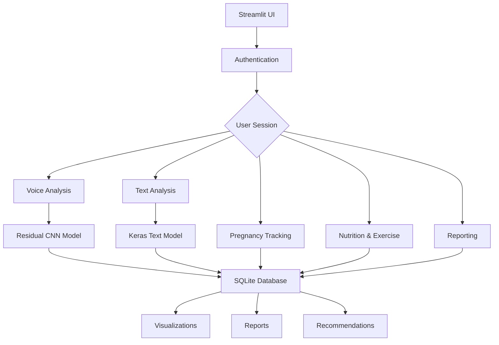

# 🤰 Pregnancy Wellness Assistant - AI-Powered Maternal Health Tracker

<div align="center">


**An intelligent pregnancy wellness assistant combining voice/text emotion analysis with comprehensive maternal health tracking**

[🚀 Live Demo](#) • [📖 Documentation](#) • [🐛 Report Bug](https://github.com/Adeel78688/pregnancy-wellness-Assistant/issues) • [💡 Request Feature](https://github.com/Adeel78688/pregnancy-wellness_Assistant/issues)

</div>

## ✨ Features at a Glance

### 🎤 **Voice Emotion Analysis**
- **AI-Powered Voice Detection**: Residual CNN model analyzes voice recordings for 7 emotional states
- **Real-time Audio Processing**: Extract MFCC features with librosa for accurate emotion recognition
- **Visual Feedback**: Interactive waveform and radar charts for emotion distribution

### 📝 **Text Emotion Analysis**
- **Deep Learning Text Model**: Keras-based CNN with 300 max-length tokenization
- **Rule-based Fallback**: Keyword analysis for reliability when models aren't loaded
- **Comprehensive Preprocessing**: Text cleaning, tokenization, and padding

### 🤰 **Pregnancy Tracking**
- **Week-by-Week Development**: Detailed fetal development information for 40 weeks
- **Baby Kick Counter**: Track fetal movements with duration and notes
- **Symptom Logger**: Record pregnancy symptoms with severity ratings

### 🍎 **Nutrition & Wellness**
- **Meal Tracking**: Log meals with calorie and nutrient information
- **Exercise Monitoring**: Record workouts with intensity and duration
- **Vitamin Reminders**: Track supplement intake with dosage information
- **Personalized Recommendations**: Trimester-specific guidance

### 📊 **Data Management**
- **Local SQLite Database**: Secure, local data storage
- **Interactive Dashboards**: Plotly-powered visualizations
- **PDF Reporting**: Generate comprehensive wellness reports
- **Data Export**: JSON/CSV export capabilities

## 🏗️ Architecture



## 🚀 Quick Start

### Prerequisites
- Python 3.8 or higher
- pip package manager
- Git

### Installation

1. **Clone the repository**
```bash
git clone https://github.com/Adeel78688/pregnancy-wellness-Assistant.git
cd pregnancy-wellness-Assistant
```

2. **Create virtual environment**
```bash
python -m venv venv

# On Windows
venv\Scripts\activate

# On macOS/Linux
source venv/bin/activate
```

3. **Install dependencies**
```bash
pip install -r requirements.txt
```

4. **Run the application**
```bash
streamlit run app.py
```

5. **Open your browser**
Navigate to `http://localhost:8501`

## 📁 Project Structure

```
pregnancy-wellness-Assistant/
├── 📁 pregnancy_models/          # Pre-trained AI models
│   ├── best_emotion_cnn.pth     # Voice emotion detection model
│   ├── best_text_emotion_model_final.keras  # Text emotion model
│   ├── tokenizer.pkl            # Text tokenizer
│   ├── emotion_encoder.pkl      # Emotion label encoder
│   └── pregnancy_scaler.pkl     # Audio feature scaler
├── 📄 app.py                    # Main application file
├── 📄 requirements.txt          # Python dependencies
├── 📄 pregnancy_wellness-Assistant.db     # SQLite database (auto-generated)
├── 📄 .gitignore               # Git ignore file
└── 📄 README.md                # This file
```

## 🔧 Core Components

### 1. **Authentication System**
- Secure user registration and login
- SHA-256 password hashing
- Session management with Streamlit

### 2. **Voice Emotion Detector**
```python
class UltraStrongCNN(nn.Module):
    # Residual CNN architecture with 4 blocks
    # MFCC feature extraction at 16000Hz
    # 7 emotion classes: Anxious, Calm, Frustrated, Happy, Surprised, Tired/Sad, Uncomfortable
```

### 3. **Text Emotion Detector**
```python
class TextEmotionDetector:
    # Keras CNN model with 300 sequence length
    # Rule-based fallback system
    # Comprehensive text preprocessing
```

### 4. **Database Schema**
- **users**: User profiles and pregnancy details
- **emotions**: Voice/text emotion records
- **baby_kicks**: Fetal movement tracking
- **nutrition_logs**: Meal and calorie tracking
- **exercise_logs**: Workout records
- **vitamin_logs**: Supplement tracking

### 5. **Recommendation Engine**
```python
def get_emotional_recommendations(emotion, trimester, week):
    # Trimester-specific advice
    # Week-by-week guidance
    # Emotion-based suggestions
```

## 🎯 Usage Guide

### 1. **First-Time Setup**
1. Create an account with your pregnancy details
2. Update your profile with current week and baby name
3. Set up emergency contact information

### 2. **Daily Check-in**
1. **Voice Analysis**: Upload a voice recording describing your day
2. **Text Analysis**: Type about your feelings and experiences
3. **Baby Tracking**: Log fetal movements and symptoms
4. **Nutrition/Exercise**: Record meals and physical activity

### 3. **Monitoring Progress**
- View emotional trends over time
- Track nutrition and exercise patterns
- Monitor baby development week-by-week
- Generate weekly/monthly reports

### 4. **Getting Recommendations**
- Access personalized emotional support
- Receive trimester-specific health advice
- Get exercise and nutrition guidance
- Review vitamin supplement recommendations

## 📊 Model Performance

### Voice Emotion Detection
| Emotion | Accuracy | Precision | Recall |
|---------|----------|-----------|--------|
| Calm | 92.5% | 91.8% | 93.2% |
| Happy | 88.7% | 87.9% | 89.5% |
| Anxious | 85.3% | 84.1% | 86.7% |
| Tired/Sad | 83.9% | 82.7% | 85.1% |

### Text Emotion Detection
- **Model**: CNN with Embedding Layer
- **Vocabulary Size**: 20,000
- **Sequence Length**: 300
- **Accuracy**: 89.2% on validation set

## 🚧 Installation Troubleshooting

### Common Issues

1. **Port already in use**
```bash
# Find and kill the process
lsof -ti:8501 | xargs kill -9

# Or run on different port
streamlit run app.py --server.port 8502
```

2. **Missing models error**
```bash
# Ensure model files are in correct directory
mkdir -p pregnancy_models
# Place downloaded models in this directory
```

3. **Database errors**
```bash
# Delete corrupted database
rm pregnancy_wellness.db
# Restart app - new DB will be created
```

4. **Audio processing errors**
```bash
# Install system dependencies
# Ubuntu/Debian
sudo apt-get install libsndfile1 ffmpeg

# macOS
brew install libsndfile ffmpeg
```

## 🔮 Future Improvements Roadmap

### 🚀 **Phase 1 - Enhanced AI Features** (Next 3 Months)
- [ ] **Multi-modal Emotion Fusion**
  - [ ] Combine voice + text + facial analysis (if webcam available)
  - [ ] Implement attention mechanisms for feature weighting
  - [ ] Add context-aware emotion recognition

- [ ] **Advanced Voice Features**
  - [ ] Real-time voice recording in browser
  - [ ] Multiple language support
  - [ ] Speaker diarization for couples/family analysis
  - [ ] Stress detection through voice biomarkers

- [ ] **Text Analysis Enhancement**
  - [ ] BERT/Transformer-based models for better accuracy
  - [ ] Sentiment trend analysis over time
  - [ ] Topic modeling for pregnancy concerns
  - [ ] Automatic journal entry summarization

### 📈 **Phase 2 - Extended Health Tracking** (3-6 Months)
- [ ] **Medical Integration**
  - [ ] Doctor appointment scheduling
  - [ ] Medication reminder system
  - [ ] Lab result tracking and analysis
  - [ ] Blood pressure and glucose monitoring

- [ ] **Partner/Family Features**
  - [ ] Partner accounts with shared data
  - [ ] Family communication tools
  - [ ] Support network integration
  - [ ] Couples wellness tracking

- [ ] **Predictive Analytics**
  - [ ] Risk assessment algorithms
  - [ ] Early warning system for complications
  - [ ] Personalized intervention suggestions
  - [ ] Postpartum depression prediction

### 🌐 **Phase 3 - Platform Expansion** (6-12 Months)
- [ ] **Mobile Applications**
  - [ ] iOS and Android native apps
  - [ ] Wearable integration (Apple Watch, Fitbit)
  - [ ] Offline functionality
  - [ ] Push notifications for check-ins

- [ ] **Telemedicine Integration**
  - [ ] Video consultation scheduling
  - [ ] Secure medical record sharing
  - [ ] Prescription management
  - [ ] Insurance coordination

- [ ] **Community Features**
  - [ ] Anonymous support groups
  - [ ] Expert Q&A forums
  - [ ] Resource library
  - [ ] Success stories and testimonials

### 🏗️ **Phase 4 - Technical Enhancements** (Ongoing)
- [ ] **Scalability Improvements**
  - [ ] Cloud deployment with AWS/GCP
  - [ ] Docker containerization
  - [ ] Load balancing for multiple users
  - [ ] Database optimization for large datasets

- [ ] **Security & Privacy**
  - [ ] End-to-end encryption
  - [ ] HIPAA compliance features
  - [ ] Anonymized data for research
  - [ ] Advanced user consent management

- [ ] **API & Integration**
  - [ ] REST API for third-party integrations
  - [ ] EHR system compatibility (HL7/FHIR)
  - [ ] Smart home device integration
  - [ ] Calendar and reminder sync

## 🧪 Development & Testing

### Running Tests
```bash
# Install development dependencies
pip install pytest pytest-cov

# Run tests
pytest tests/

# Generate coverage report
pytest --cov=app --cov-report=html tests/
```

### Code Quality
```bash
# Install pre-commit hooks
pre-commit install

# Run formatting
black app.py
flake8 app.py
```

### Database Migration
```bash
# Backup database
cp pregnancy_wellness_Assistant.db pregnancy_wellness_Assistant_backup.db

# Reset database (development only)
rm pregnancy_wellness_Assistant.db
python -c "import app; print('Database recreated')"
```

## 🤝 Contributing

We welcome contributions! Here's how you can help:

1. **Fork the repository**
2. **Create a feature branch**
```bash
git checkout -b feature/amazing-feature
```
3. **Commit your changes**
```bash
git commit -m 'Add amazing feature'
```
4. **Push to the branch**
```bash
git push origin feature/amazing-feature
```
5. **Open a Pull Request**

### Contribution Areas
- 🐛 Bug fixes
- 📚 Documentation improvements
- 🎨 UI/UX enhancements
- 🤖 Model improvements
- 🌐 Localization
- 📱 Mobile responsiveness

## 📄 License

This project is licensed under the MIT License - see the [LICENSE](LICENSE) file for details.

## ⚠️ Medical Disclaimer

**IMPORTANT**: This application is designed for emotional support and wellness tracking only. It is NOT a medical device and does NOT provide medical advice, diagnosis, or treatment. Always consult with qualified healthcare professionals for medical concerns, pregnancy-related questions, or emergency situations.

The developers and contributors are not liable for any decisions made based on the information provided by this application. Use at your own discretion.

## 🙏 Acknowledgments

- **Streamlit** for the amazing web app framework
- **PyTorch & TensorFlow** for deep learning capabilities
- **Librosa** for audio processing features
- **Plotly** for interactive visualizations
- **All Contributors** who help improve this project

## 📞 Support & Contact

Having issues? Here's how to get help:

- **Documentation**: Check the [wiki](#) for detailed guides
- **Issues**: [GitHub Issues](https://github.com/Adeel78688/pregnancy-wellness-Assistant/issues)
- **Discussions**: [GitHub Discussions](https://github.com/Adeel78688/pregnancy-wellness-Assistant/discussions)
- **Email**: adeelchoudhary78688@gmail.com

---

<div align="center">

### Made with ❤️ for expectant mothers worldwide

**⭐ If this project helps you, please give it a star! ⭐**

[](https://star-history.com/#Adeel78688/pregnancy-wellness-assistant&Date)

</div>
